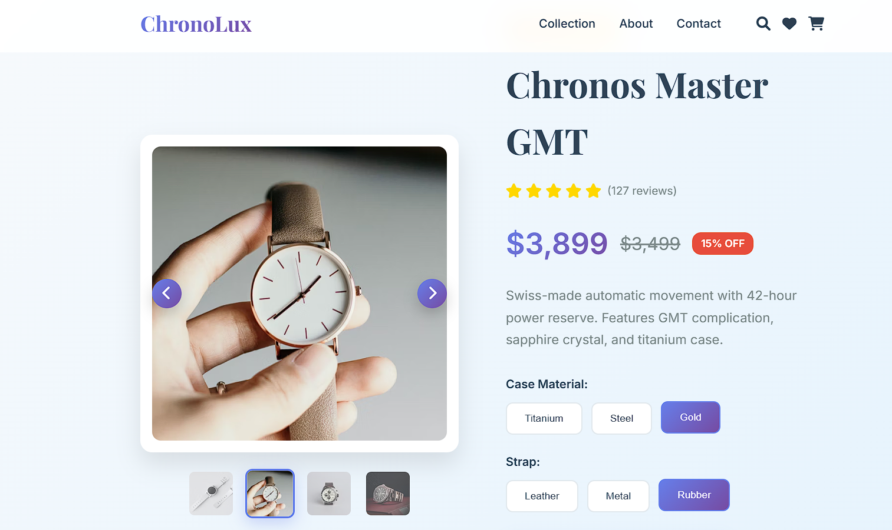

# ⌚ ChronoLux - Premium Watch E-Commerce Landing Page

> **A modern, responsive e-commerce landing page showcasing luxury watches with advanced carousel functionality and interactive product features.**

## 🌟 Live Demo

[**View Live Demo →**](https://chrono-lux-e-commerce-landing-page.vercel.app/)

## ✨ Features

### 🎠 **Advanced Image Carousel**
- ✅ **4-Image Carousel** with smooth transitions
- ✅ **Thumbnail Navigation** with active state indicators
- ✅ **Auto-play Functionality** (5-second intervals)
- ✅ **Keyboard Navigation** (Arrow keys)
- ✅ **Touch/Swipe Support** for mobile devices
- ✅ **Error Handling** with fallback images

### 🛍️ **Interactive Product Features**
- ✅ **Dynamic Pricing** based on material/strap selection
- ✅ **Product Options Toggle** (Case Material & Strap)
- ✅ **Expandable Specifications** section
- ✅ **Add to Cart Animation** with floating effects
- ✅ **Wishlist Toggle** with visual feedback
- ✅ **Loading States** for better UX

### 🎨 **Modern UI/UX**
- ✅ **Unique Gradient Color Scheme** (Ocean & Gold theme)
- ✅ **Glassmorphism Effects** on navigation
- ✅ **Smooth Animations** with cubic-bezier transitions
- ✅ **Hover Effects** and micro-interactions
- ✅ **Custom Scrollbar** styling

### 📱 **Responsive Design**
- ✅ **Mobile-First Approach**
- ✅ **Tablet & Desktop Optimization**
- ✅ **Cross-browser Compatibility**
- ✅ **Touch-friendly Interface**

## 🖼️ Screenshots

## 🛠️ Technologies Used

### **Frontend Stack**
- **HTML5** - Semantic markup and structure
- **CSS3** - Advanced styling with Grid, Flexbox, and CSS Variables
- **Vanilla JavaScript (ES6+)** - Interactive functionality and DOM manipulation

### **Design & UX**
- **CSS Custom Properties** - Maintainable design system
- **CSS Grid & Flexbox** - Modern layout techniques
- **CSS Animations** - Smooth transitions and micro-interactions
- **Font Awesome Icons** - Professional iconography
- **Google Fonts** - Premium typography (Playfair Display & Inter)

### **APIs & Services**
- **Unsplash API** - High-quality product images
- **Placeholder.com** - Fallback images for error handling

